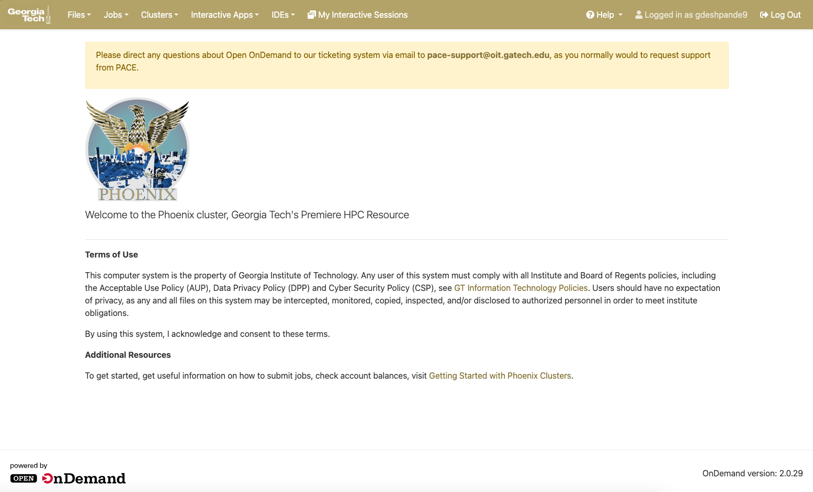
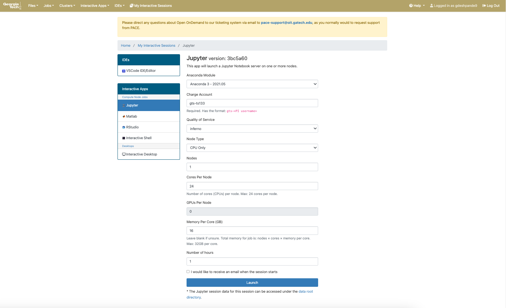
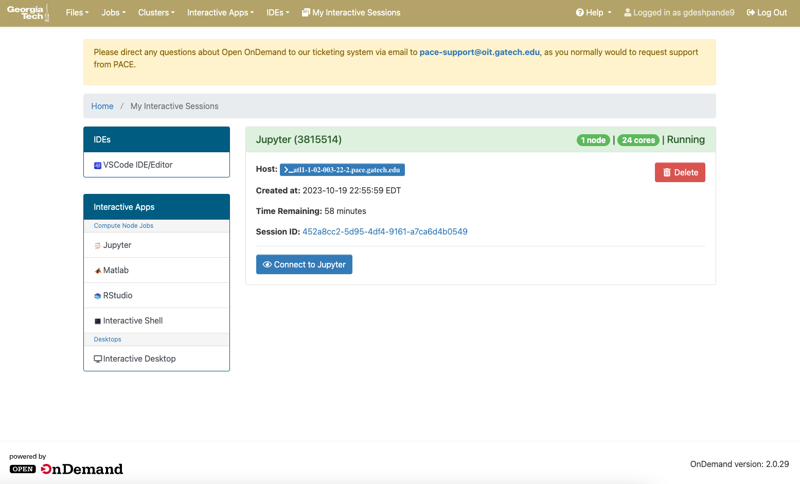

# Intro To PACE ICE

Welcome to PACE! PACE stands for Partnership for an Advanced Computer Environment. PACE is one of the HPC Clusters available for GT Researchers and students to use for intensive computational tasks, and ICE is the computing cluster used in classrooms. The official PACE website can be found [here](https://pace.gatech.edu/). This has been heavily inspired from [this repository](https://github.com/guru-desh/Intro-To-PACE-Phoenix) that focuses on PACE's research cluster.

**This is meant to be made as a living document. If you would like to contribute to this document, please make a PR!**

## Getting Started with PACE

For a student to use PACE ICE, the class must register with PACE to be allowed to use ICE. Instructions on the PACE website can be found [here](https://pace.gatech.edu/participation).

If you are a student reading this, hopefully you're class has already done this, so you don't need to read this.

## Accessing PACE

Access to PACE is only done via `ssh`. You need to have the GT VPN Client installed to access PACE whether or not you are on eduroam. Instructions on installing the GT VPN Client are provided within the [PACE documentation](https://docs.pace.gatech.edu/gettingStarted/vpn/).

The command to `ssh` into PACE is `ssh <gtusername>@login-ice.pace.gatech.edu`. An example with the username `gburdell3` looks like `ssh gburdell3@login-ice.pace.gatech.edu`. The [PACE documentation](https://docs.pace.gatech.edu/gettingStarted/logon/) provides additional information for this step. Remember that you need to follow the instructions for the ICE Cluster.

You can also use your favorite IDE to access PACE via `ssh`. [VS Code](https://code.visualstudio.com/docs/remote/ssh) and PyCharm.

## Things to do on your first time on PACE

### Set Anaconda Symlink

Changing the Anaconda symlink is necessary to make sure that you can use Anaconda. Many Anaconda environments take up multiple GBs of space, which means that it's not practical using them on your personal storage on PACE since that is restricted to only 15GB. This can be fixed using the following command from `~`.

```bash
mkdir ./scratch/.conda
ln -s $(pwd)/scratch/.conda ~/.conda
```

What this does is that everytime you create a new environment or install a package, your packages are now installed inside `scratch`, which has 300GB, and the `.conda` folder inside `~` points to `./scratch/.conda`.

### Set `.cache` symlink

Changing the `.cache` symlink is necessary to make sure that you can use libraries that save models into this folder like PyTorch and huggingface. Models can take up multiple GBs of space, which means that it's not practical using them on your personal storage on PACE since that is restricted to only 15GB. This can be fixed using the following command from `~`.

```bash
mkdir ./scratch/.cache
ln -s $(pwd)/scratch/.cache ~/.cache
```

## How to use the PACE Documentation

The [PACE documentation](https://docs.pace.gatech.edu/) contains a lot of documentation around how to use PACE and get familiar with modules used in PACE. Here's some important links to specific parts of the PACE documentation:

1. [ICE Cluster Documentation](https://docs.pace.gatech.edu/ice_cluster/ice/)
2. [Example Jobs with SLURM](https://docs.pace.gatech.edu/ice_cluster/ice_slurm/)
3. [PACE Software Stack](https://docs.pace.gatech.edu/slurm-software/software_list/)
4. [Open OnDemand for Interactive Jobs](https://docs.pace.gatech.edu/ood/guide/)
5. [PACE Computational Resources](https://docs.pace.gatech.edu/ice_cluster/ice_resources/)

Important notes on PACE documentation:

- Many parts of the documentations reference PBS scripts. This is deprecated since SLURM is being used. Ignore these PBS scripts
- We are only using the ICE Cluster. Information about the Hive, Phoenix, or Firebird Cluster should be ignored.

# Storage on PACE

Storage on PACE is a bit complicated. There are three types of storage on PACE each serving a different purpose.
You can always find how much storage each of these buckets are holding using the `pace-quota` command.

## Personal

The personal storage is storage that you as the user can claim to your name. It's pretty small at **15 GB**, and can get filled very quickly. It is for this reason that I don't use the personal storage at all.

## Scratch

The scratch storage is probably the more interesting of all the storage options. It can hold **300 GB** of data. However there's two catches with this. First, scratch storage is limited to you as the user. This means that if you have multiple collaboraters, then each collaborater would have to store the same data in their scratch storage. Second, data in the scratch storage is wiped after the semester ends. **It is important that you have all your important data in the scratch directory backed up externally**.

## Transferring Files to and from PACE

PACE recommends that you use Globus to transfer files to and from PACE. I have tried this before, but it is very buggy. I personally recommend using `scp` or `rsync` as ways to transfer files to and from PACE.

In general, the structure for using `rsync` is as such:

```bash
rsync -a --progress <SOURCE COMPUTER>:<SOURCE FILES/FOLDER> <DESTINATION COMPUTER>:<DESTINATION FOLDER>
```

Here's an example command to transfer files *to* PACE from my personal computer:

```bash
rsync -a --progress home.txt gdeshpande9@login-ice.pace.gatech.edu:/home/hice1/gdeshpande9/scratch
```

This transfers the `hello.txt` from my computer to PACE.

Using `scp` is very similar as well. I won't cover `scp` since `rsync` was already covered. If interested, you can find more information on `scp` [here](https://linuxize.com/post/how-to-use-scp-command-to-securely-transfer-files/).

# Setting up Environments on PACE

## Conda Environments

You cannot use `conda` directly once you log into PACE. You need to *load in the `conda` module*. This is the process for any other modules that PACE offers. You can reference [the PACE documentation](https://docs.pace.gatech.edu/slurm-software/software_list/) to see all the offered software.

**To load in `conda`, run the command `module load anaconda3`**. You should see that the `base` environment is now active. **You must create your environment**. You cannot use the `base` environment since it not writable. From here, all the regular `conda` commands to create, activate, and install packages into environments will work as standard. To avoid unexpected issues, please make sure to follow [the intro steps](#things-to-do-on-your-first-time-on-pace).

## Even more custom environments

PACE doesn't have every module in the world available to use. This means that we have to provide a container that contains this informatation and give it to PACE so we can run experiments with our environment but leverage the Phoenix Cluster. This process is straightforward, but requires back-and-forth with PACE Support and **is a multi-month process**.

If you really need to create a new environment, here's the steps that you would need to follow:

1. Create a Docker image with your requirements
2. Publish this Docker to Docker Hub
3. Send an email to PACE OIT Support requesting for a new container. The email should contain the following
   1. Your Name
   2. PI's Name
   3. Link to Docker image on Docker Hub
   4. Link/upload of your Dockerfile used to create the image
   5. Legitimate reasons why you need this container and why PACE cannot natively reproduce this environment with their modules. **If this reason cannot be provided, your request will be rejected.**
   6. Ask for the container to be placed in the project storage.

PACE will create an apptainer container. Apptainer is very similar to Docker, but it retains user permissions. Apptainer can also be interchanged with singularity (that was the original name).

# Running Jobs on PACE

This is the most important section of this entire document. We'll talk about how to run jobs and get computation from PACE. There's two types of ways to schedule resources from PACE called interactive and non-interactive jobs. Interactive jobs are the easier of the two.

## Interactive Jobs

Interactive Jobs are one of the most easiest jobs to get started with in PACE. 

### Using Open OnDemand (Recommended)

PACE has really put initiative into adding Open OnDemand to their platform, which creates a nice UI that handles everything neatly. Interactive Jobs can do all types of jobs well except for Job Arrays and sometimes environment setup with Apptainer (except for the terminal/command line option), which a non-interactive job handles better. You can go [here](https://docs.pace.gatech.edu/ood/guide/) to access Open OnDemand for the ICE Cluster. Note that you will have to sign into SSO and be on the GT VPN to access it.

Here is what the home page looks like:



You have four tabs at the top. To create an interactive job, click on the *Interactive Apps* tab. The dropdown options are *Jupyter*, *Matlab*, *RStudio*, *Interactive Shell*. For this demonstration, let's assume that I will create a Jupyter Server on PACE.

Here are the options that I have when creating a Jupyter Server



You can choose between 4 Anaconda environments. Two of them are a Tensorflow environment and the other is a PyTorch environment. I personally haven't been able to use the default Anaconda option but still use a different conda environment that I had already setup.

You can change the account. It uses the default free-tier option.

There is usually only one type of quality of service for students which is either `coc-ice` or `pace-ice` depending on the class. If you are a TA, then you can use `coc-grade` or `pace-grade`, which gives you priority in the queue.

In Node Type, you can specify if you want a GPU node. There's 3 different types of GPUs you can get including a V100, RTX 6000, and an A100.

You can specify the number of nodes you want. I always select 1 for interactive jobs, since it's difficult to manage multiple nodes in an interactive job.

You can also specify the number of cores for node. The maximum is 24 cores.

Memory per core determines the amount of RAM a node receives.

Number of hours dictates how long you want this to run for.

After starting the job, you will see this:



This means that your request is in the queue.

After some time, the page will change to this:


You can now access your Jupyter Server. It will give you the exact same experience as working with Jupyter locally. This same experience applies to the other options available in Open OnDemand such as VS Code, Terminal, etc.

I personally don't use Open OnDemand as much. The reason is because I use VS Code remote access feature, which already gives me exactly what I'm looking for. I also mainly schedule non-interactive jobs. I believe that Open OnDemand is useful, and I have used it before as well. It's a great introduction into PACE for beginners. It's ease of use is why PACE promotes it so much to draw researchers to use PACE in its easiest form possible.

### Using `salloc` (Not Recommended)

Another way to start an interactive job is to use the `salloc` command. The `salloc` command allows you to stay within your current terminal in PACE and enter the machines requested for the job. The advantage of this is that you don't need to leave your terminal. The disadvantage is that this is less powerful compared to the options offered in PACE's Open OnDemand instance and it also requires decent SLURM knowledge.

`salloc`, like `sbatch` requires different flags to set the configuration for the job. `sbatch` and `salloc` share the same flags, so if you have flags defined in an `.sbatch` file, then you can edit it to immediately use `salloc`. **This section is written assuming that you have knowledge of `sbatch`. Please read about `sbatch` in the [non interactive job section](#non-interactive-jobs).**

As an example, let's use an existing `sbatch` configuration and convert it so that it can be used with `salloc`. In the [example single node CPU Job configuration](#single-node-cpu-jobs), the job configuration was defined as the following:

```bash
#SBATCH --job-name=Task
#SBATCH --nodes=1 --ntasks-per-node=24
#SBATCH --time=2:00:00
#SBATCH --qos=coc-ice
#SBATCH --output=./logs/task.out
#SBATCH --mail-type=NONE
```

**To use `salloc` with the same job configuration, you should copy all flags except for `--job-name`, `--output`, `--mail-type`** since `salloc` starts a job instantly instead of putting a job in a queue like `sbatch`. The final `salloc` command would be the following:

```bash
salloc --nodes=1 --ntasks-per-node=24 --time=2:00:00 --qos=coc-ice
```

## Non-Interactive Jobs

Like mentioned before, there are some limitations to using Open OnDemand and interactive jobs. The two main drawbacks are the inability to effectively manage job arrays, and the inability to use your own container. Non-interactive jobs allow you to control SLURM, which is a scheduler that PACE uses to get you the compute you request for. Open OnDemand also uses SLURM, but you get to control it through a nice looking UI with those options I mentioned earlier. We'll take a look at how to manipulate SLURM to do more complicated tasks.

### Single Node CPU Jobs

The single node CPU job is one of the simplest jobs to schedule on PACE. This, at minimum requires one file, but can require two files if you are using `bash` to run a shell script.

The two main important files are the `.sbatch` file and the other one is the `.sh` file. The `.sbatch` file is how you configure SLURM to get the correct configuration you want. The `.sh` actually executes the task at hand. Let's show what an example `.sbatch` file would look like:

```bash
#!/bin/bash

#SBATCH --job-name=Task
#SBATCH --nodes=1 --ntasks-per-node=24
#SBATCH --time=2:00:00
#SBATCH --qos=coc-ice
#SBATCH --output=./logs/task.out
#SBATCH --mail-type=NONE

cd $SLURM_SUBMIT_DIR

bash task.sh 
```

The configurations are defined in the `#SBATCH` lines. We define the job name, nodes, time, the quality of service, where to store the output log, and whether we want to receive emails or not.

The `cd $SLURM_SUBMIT_DIR` tells SLURM to enter the directory where the job was submitted from.

Here's what the `task.sh` file looks like:

```bash
#!/bin/sh
cd /CODE-DIRECTORY || exit
python3 task.py
```

Here, we tell SLURM to change directory to where our code lives and run a python script. Remember that you have to use the path that's inside the container -- not the PACE path.

Inside the `Templates` folder, I provide a template of how to create a single node CPU Job. These two files are provided.

#### Where do I activate my `conda` environment?

If you have a `conda` environment and a Python file, then you can use this template:

```bash
#!/bin/bash

#SBATCH --job-name=Task
#SBATCH --nodes=1 --ntasks-per-node=24
#SBATCH --time=2:00:00
#SBATCH --qos=coc-ice
#SBATCH --output=./logs/task.out
#SBATCH --mail-type=NONE

cd $SLURM_SUBMIT_DIR

module load anaconda3
conda activate environment_name
python3 task.py
```

`module load anaconda3` and `conda activate environment_name` will allow you to load in anaconda and set the environment before the python program is executed. **This `conda` formulated example will be carried onto the next sections.**

### Single Node GPU Jobs

Running Single Node GPU Jobs is a simple change in the `.sbatch` file. Let's see what the change looks like:

```bash
#!/bin/bash

#SBATCH --job-name=Task
#SBATCH --nodes=1 --ntasks-per-node=12 --gres=gpu:V100:1
#SBATCH --time=2:00:00
#SBATCH --qos=coc-ice
#SBATCH --output=./logs/task.out
#SBATCH --mail-type=NONE

cd $SLURM_SUBMIT_DIR

module load anaconda3
conda activate environment_name
python3 task.py
```

The only line that was changed was this one:

```bash
#SBATCH --nodes=1 --ntasks-per-node=12 --gres=gpu:V100:1
```

Here, we add an extra tag to schedule a V100 GPU. For each V100 GPUs, we can only reserve 12 CPU cores. For each RTX 6000 GPU, we can only reserve 6 CPU cores. This makes sense as we can reserve 2 V100 GPUs and get 24 cores or 4 RTX 6000 GPUs and get 24 cores. Either way, we cannot get more than 24 cores.

### Multi Node GPU Jobs

Running Multi Node GPU Jobs is a simple change in the `.sbatch` file. Let's see what the change looks like:

```bash
#!/bin/bash

#SBATCH --job-name=Task
#SBATCH --nodes=3 --ntasks-per-node=24 --gres=gpu:V100:2
#SBATCH --time=2:00:00
#SBATCH --qos=coc-ice
#SBATCH --output=./logs/task.out
#SBATCH --mail-type=NONE

cd $SLURM_SUBMIT_DIR

module load anaconda3
conda activate environment_name
python3 task.py
```

The only line that was changed was this one:

```bash
#SBATCH --nodes=3 --ntasks-per-node=24 --gres=gpu:V100:2
```

Compared to the previous `.sbatch` file, we add 2 GPUs per node, but also reserve 3 nodes in total. This means that in this one job alone, we have reserved 6 GPUs. If you want to do distributed deep learning training, PyTorch provides an easy way to handle these multiple node situations. PyTorch Lightning makes it even easier.

### About Job Arrays

Before we get started with how to schedule job arrays, we should answer these two very important questions:

1. What is a Job Array?
2. Why would anyone use one?

#### What is a Job Array?

A job array is a way to schedule multiple nodes at the same time. This uses a fundamentally different technique that scheduling one job where you request multiple nodes. See the diagram below for the difference:


Here, with the simple one request for multiple nodes, we create one job where we get multiple nodes. However, your code must be able to access each of those nodes and manage computations on them. This is most often done with something called MPI (message passing interface) where you can send and receive messages from computers. However, implementing MPI can take time and skill.

A job array is different because you submit one request. Then, SLURM submits multiple requests requesting for the same node configuration. These nodes all have an identical environment setup and compute configuration. **Notice how it is possible for that not all of the job array nodes will be available at the same time since each individual job array node request goes through the queue.** However, it's much easier to manipulate job arrays since you can batch your input based on the job array node you are on. This can be done by accessing the `SLURM_ARRAY_TASK_ID` environment variable.

#### Why would anyone use one?

There are many cases where you have a process $A$ and a bunch of inputs $B$ where $b \in{B}$. $b$ is one of the many inputs that in total create $B$. Let's say we want to apply $A$ to all of $B$. We could go through each $b$ one-by-one. This is called going through $B$ *sequentially*. If we realize that process on $b$ is independent of each other, we can write code that applies $A$ to $B$ *concurrently*. The mains ways of doing this is via *multithreading* and *multiprocessing*.

However, we will find limitations even in concurrency. Multiprocessing, for example, depends on the number of cores your processor has. Even the number of cores on one processor is limited based on power draw and other thermal problems that arise with too many cores.

We can then come to a realization that we need more than one computer to help us. We can split $B$ by the number of computers that we have available. If we have $N$ computers, then the grand total of inputs for each computer is $\frac{B}{N}$. We can parallelize $A$ on each individual computers and run the computers at the same time. This means that instead of having to wait for all of $B$ to finish processing, we only wait for $\frac{B}{N}$.

You can also think of this as a way of constructing an enormous computer with $N * n$ cores where $n$ is the number of cores a single computer has.

Let me give you a real example and get away from the variables for a second. Let's say that I have 200,000 videos in `.mp4` format, and I want to convert them each to a 4D NumPy Array `(number of frames, R, G, B)` to increase loading time into my PyTorch model. On average, we can say that the conversion of one vidoe to a NumPy Array takes 2 minutes. In my professor's lab, we have a computer called Ebisu that has 32 cores. If we were to parallelize this operation (assumming that Ebisu had infinite memory to store all the videos in RAM), it would take the following amount of time to complete:

$$ 200,000 \frac{\text{videos}}{} * \frac{\text{2 minutes}}{\text{1 video}} * \frac{}{\text{32 cores}} = \text{12,500  minutes} $$

12,500 minutes is about 8 days.

If we were to use a job array where I can schedule 100 of these 24 core nodes, we can see it would take the following amount of time to complete:

$$ 200,000 \frac{\text{videos}}{} * \frac{\text{2 minutes}}{\text{1 video}} * \frac{}{\text{100 nodes}} * \frac{}{\text{24 cores}} = \text{174 minutes} $$

174 minutes is around 3 hours.

We can see how using a job array makes things faster!

### Using Job Arrays

We want our job arrays to follow this process


First, we batch all of our data into text files. This part of the process should happen very quickly as we are scanning the filesystem to files to process and creating text files with a roughly equal number of input files.

Then, we run the job array. In each node, we read in the batch file associated with that node using the `SLURM_ARRAY_TASK_ID` (note that this starts at 1 and not 0). Then, in each node, we parallelize across the inputs files. We can then see our outputs.

Let's see how the `.sbatch` file has changed:

```bash
#!/bin/bash

#SBATCH --job-name=Job-Array-Template
#SBATCH --nodes=1 --ntasks-per-node=24
#SBATCH --time=4:00:00
#SBATCH --qos=coc-ice
#SBATCH --output=logs/Task%a.out
#SBATCH --mail-type=NONE
#SBATCH --array=1-100

cd $SLURM_SUBMIT_DIR

module load anaconda3
conda activate environment_name
bash run_task.sh 
```

Here, we have added an extra `#SBATCH` line to specify that we want 100 nodes in our job array. How has the `.sh` file changed?

```bash
#!/bin/sh
cd /CODE-DIRECTORY || exit
python3 task.py \
--jobArrayNum "${SLURM_ARRAY_TASK_ID}"
```

Here, now we pass in an argument of the `SLURM_ARRAY_TASK_ID` into our script.

In the Templates folder, I provide an outline on how to run a job array with these files.

# SLURM Command Cheatsheet

- `squeue -A <ACCOUNT>` - Checks jobs related to a PACE account
- `scancel <JOB_ID>` - Cancels a job on PACE
- `module load anaconda3` - Loads Anaconda (so you can create your own conda environments)

# PACE Command Cheatsheet

- `pace-quota` - Gives information on PACE Storage and money in accounts

# Contact for Questions

If I am still a TA for ML, you can find me on EdStem.
My GT email address is <gurudesh@gatech.edu>